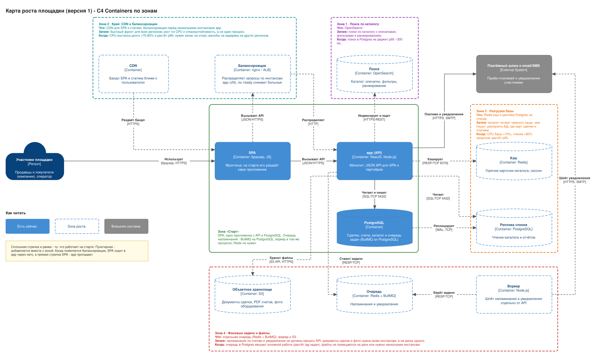

# system-design

Бэкенд на NestJS с Postgres, Redis, OpenSearch и SeaweedFS (S3-совместимое хранилище), запускается через Docker Compose.

## Стек и почему

- **NestJS, созданный через `nest new`** — Nest CLI генерирует стандартную структуру проекта (`nest-cli.json`, `tsconfig*.json`, `src/app.*`, `test/`) и настраивает `nest build`/`nest start`, вместо ручной сборки этой структуры. Это привычная отправная точка для Nest-приложения, знакомая любому Nest-разработчику.
- **Express, а не Fastify, как HTTP-адаптер** — проект использует `@nestjs/platform-express` (`NestFactory.create(AppModule)`), то есть платформу Nest по умолчанию. Fastify (`@nestjs/platform-fastify`, `NestFactory.create<NestFastifyApplication>(AppModule, new FastifyAdapter())`) на уровне Nest заменяется без переделок и обычно быстрее благодаря валидации по схеме, но экосистема готовых middleware у него меньше, а API запроса и ответа менее привычен тем, кто пришёл с чистого Express. Здесь нет задержек, критичных настолько, чтобы нуждаться в преимуществе Fastify, поэтому выигрывают большая экосистема и знакомство с Express.
- **TypeORM** — официальная интеграция `@nestjs/typeorm`, сущности на декораторах, миграции через CLI (`synchronize: false`; схема меняется только миграцией).
- **oxlint, а не ESLint** — линтер на Rust, который работает на порядки быстрее ESLint и покрывает нужные проекту правила корректности и стиля (включая проверки с учётом типов через `oxlint-tsgolint`). Платой за это стала куда меньшая экосистема плагинов ESLint (например, правила для фреймворков или сильно кастомные наборы). Для проекта такого размера скорость важнее.
- **Prettier** — отвечает только за форматирование и отделён от линтера, чтобы правила oxlint касались корректности, а не споров о стиле; `format:check` — проверка в CI, `format` — команда для исправления.
- **Vitest** — нативная поддержка ESM без дополнительных флагов (проект использует `"type": "module"`), быстрый, а `coverage.thresholds` идут из коробки вместе с `@vitest/coverage-v8`.
- **pino через `nestjs-pino`** — структурированные JSON-логи (готовы к отправке в OpenSearch), самый быстрый логгер в экосистеме Node, заменяет встроенный логгер Nest; `pino-pretty` используется только при `NODE_ENV=development`.
- **OpenSearch** вместо Elasticsearch — лицензия Apache 2.0, плагин безопасности для локальной разработки отключается без усилий.
- **SeaweedFS** вместо MinIO — `minio/minio` теперь требует входа в Docker Hub для загрузки; S3-шлюз SeaweedFS (`chrislusf/seaweedfs`) свободно скачивается, активно поддерживается и совместим с S3.
- **Node 24 LTS** (`node:24-alpine`) — текущая Active LTS.

Redis, OpenSearch и SeaweedFS поднимаются в Compose и доступны через переменные окружения с самого начала; клиенты для них в приложении пока не подключены, их добавят, когда они понадобятся какой-нибудь функции.

## Запуск стека

```bash
cp .env.example .env
docker compose up -d --build
```

- Приложение: http://localhost:3000 (`GET /` → `Hello World!`, см. `requests.http`)
- Postgres: localhost:5432
- Redis: localhost:6379
- OpenSearch: http://localhost:9200
- S3 API SeaweedFS: http://localhost:8333, UI filer: http://localhost:8888

`.env.example` рассчитан на хост (для каждого сервиса указан `localhost`), чтобы запускать приложение или TypeORM CLI прямо на хосте. Сервис `app` в `docker-compose.yml` переопределяет нужные переменные, чтобы обращаться к соседним контейнерам по имени сервиса (`postgres`, `redis`, ...).

## Разработка

```bash
npm install
docker compose up -d postgres redis opensearch seaweedfs
npm run start:dev
```

## Проверка

Нужен Docker Compose v2 с поддержкой `up --wait`; Compose v1 эту проверку не поддерживает.

```bash
npm run ci
```

Это единственная команда, которая должна проходить, прежде чем работа считается завершённой: она запускает локальный Postgres через Docker Compose (создаёт `.env` из `.env.example`, если его ещё нет, поэтому работает на свежем клоне), затем выполняет проверку типов, линтинг, проверку форматирования и тесты с порогом покрытия 100% по строкам, ветвям, функциям и операторам. Правило и его обоснование — в `AGENTS.md`, настройки покрытия (включая исключённые файлы, у каждого из которых есть комментарий с причиной) — в `vitest.config.ts`.

Тесты идут на отдельной базе `app_test`, изолированной от базы `app`, с которой работает запущенное приложение. `db:test:ensure` (входит в `db:test:up`/`ci`) создаёт `app_test`, если её нет, поэтому запускать безопасно даже на томе Postgres, который существовал до добавления `docker/postgres/init/01-create-test-db.sql`: этот init-скрипт выполняется только на совершенно новом томе.

## Миграции

```bash
npm run build   # сущности и миграции загружаются из dist/, поэтому сначала сборка
npm run migration:generate -- src/migrations/<Name>
npm run migration:run
```

## Домашка 02 — экосистема Node.js

- **Презентация** «Node.js vs Java»: https://claude.ai/artifact/PEHouDxMP8BRYrUsCc9anV
- **Шпаргалка**: [docs/cheatsheet/node.js.md](docs/cheatsheet/node.js.md)
- **Системный дизайн**: [docs/cheatsheet/system-design.md](docs/cheatsheet/system-design.md)
- **Эксперимент** (один процесс / `cluster` / `worker_threads`): [experiments/02-event-loop](experiments/02-event-loop)

## Домашка 03 — cloud native архитектура

Задание: [tasks/03 - Cloud native архитектура.md](<tasks/03 - Cloud native архитектура.md>).

### Что добавлено

- **Конфиг по 12factor** — схема zod, проверка при старте, `.env.example` в репозитории (`src/config/env.ts`).
- **Health-checks** `/live` и `/ready` на `@nestjs/terminus`; `healthcheck` в `docker-compose.yml` вызывает `/ready` (`src/health/`).
- **Graceful shutdown** — `enableShutdownHooks`, хуки Nest, пауза для балансировщика, ожидание запросов с таймаутом, закрытие базы; ответы с `Connection: close` на время остановки, чтобы keep-alive клиенты не получали обрыв.
- **Структурированные логи** — pino, JSON в stdout, request id; в том же формате логируются старт и ошибки запуска (`src/config/nest-logger.ts`).
- **Нагрузочный скрипт** `scripts/load.mjs` для проверки остановки под нагрузкой (keep-alive и `fresh` режимы).
- **Диаграммы C4** (Context и Containers) в `docs/architecture/`.
- **Системный дизайн сквозного кейса** — карта роста, таблицы компонентов и сигналов, сценарии в `docs/system-design/marketplace-v1/`.
- **Тесты и CI** — 100% покрытие, включая e2e остановки с keep-alive клиентом и проверку `stop_grace_period` в compose.

### Проект: cloud native по 12factor

Контейнер одноразовый: платформа гасит и поднимает его когда хочет.

- **Конфиг** — только из переменных окружения, схема на zod в `src/config/env.ts` проверяется при старте (`main.ts`). Не хватает обязательной переменной — приложение пишет одну JSON-строку `fatal` с именами полей и завершается с кодом 1, не поднимая Nest. В репозитории только `.env.example`.
- **`GET /live`** — liveness, без зависимостей. **`GET /ready`** — readiness на `@nestjs/terminus`: пинг Postgres с таймаутом `HEALTH_TIMEOUT_MS` и индикатор `shutdown`. `healthcheck` в `docker-compose.yml` вызывает `/ready`. Compose не перезапускает unhealthy-контейнер: при падении базы приложение становится `unhealthy`, а когда база вернулась — снова `healthy`, без рестарта.
- **Graceful shutdown** (`src/health/shutdown.service.ts`), порядок хуков Nest: `onModuleDestroy` → `beforeApplicationShutdown(SIGTERM)` → закрытие HTTP-сервера → `onApplicationShutdown`.
  1. `onModuleDestroy` ставит флаг — `/ready` сразу отвечает 503; `beforeApplicationShutdown` ждёт `SHUTDOWN_DRAIN_MS`, чтобы балансировщик снял трафик (остальные запросы ещё обслуживаются);
  2. закрываем listener (новые соединения не принимаются), ждём текущие запросы до `SHUTDOWN_TIMEOUT_MS`, затем принудительно рвём оставшиеся. Keep-alive: с начала shutdown каждый ответ уходит с `Connection: close` (`connection-close.middleware.ts`), а простаивающие сокеты закрываются периодически — иначе клиент, который шлёт запросы по одному сокету, держал бы сервер открытым до таймаута и получил бы обрыв;
  3. `onApplicationShutdown`: закрываем соединения с базой — только после ответа на последний запрос. `TypeOrmCoreModule` делает то же самое в своём хуке; наш хук нужен ради явного лога и идемпотентен (`isInitialized`).

  `stop_grace_period` в compose (30s) должен быть больше `SHUTDOWN_DRAIN_MS + SHUTDOWN_TIMEOUT_MS`.

- **Логи** — pino, JSON в stdout, у каждого запроса `req.id` (берётся из входящего `x-request-id` или генерируется, возвращается в заголовке ответа). Пробы `/live` и `/ready` не логируются.

#### Проверка руками

```bash
docker compose up -d --build

# зависимость упала и вернулась: /ready 503 с именем database, /live 200, без рестарта
docker compose stop postgres
curl -i localhost:3000/ready; curl -i localhost:3000/live
docker compose start postgres
docker inspect -f '{{.State.StartedAt}}' $(docker compose ps -q app)   # не менялось

# graceful shutdown под нагрузкой: ни одного оборванного запроса
node scripts/load.mjs http://localhost:3000 5 &   # по умолчанию keep-alive, как у балансировщика; 4-й аргумент `fresh` — новое соединение на запрос
docker compose stop app
docker compose logs app | grep ShutdownService   # какие хуки и в каком порядке
```

`GET /work` включается `WORK_ENDPOINT_ENABLED=true` (в `.env.example` выключен, в compose включён только для локального стека; выключен — 404). Каждый запрос держит соединение из пула pg (по умолчанию 10), поэтому в `scripts/load.mjs` держите concurrency ниже размера пула, иначе `/ready` может упереться в `HEALTH_TIMEOUT_MS`. Скрипт работает по keep-alive (как балансировщик), режим `fresh` — новое соединение на запрос. Завершается с кодом 1, если хоть один запрос завершился любой ошибкой кроме ECONNREFUSED (в т.ч. ECONNRESET), получил не-2xx или ни один запрос не прошёл успешно. Docker-прокси портов может сбрасывать соединения после закрытия listener — для строгой проверки запускайте скрипт против приложения напрямую.

### Архитектурные диаграммы (C4)

- [Уровень 1 — System Context](<docs/architecture/L1 - System Context.drawio.svg>)
- [Уровень 2 — Containers](<docs/architecture/L2 - Containers.drawio.svg>)


### Системный дизайн: площадка (карта роста)

Сквозной кейс, версия 1: [docs/system-design/marketplace-v1/](docs/system-design/marketplace-v1/README.md) - карта роста по зонам, компоненты, сигналы роста и сценарии.



### Заметка о ревью

Ревью агентом-критиком провёл в новых сессиях с чистым контекстом; каждую находку проверил отдельно.

| Находка                                                                                                                                                                       | Серьёзность      | Что сделал                                                                                                                                  |
| ----------------------------------------------------------------------------------------------------------------------------------------------------------------------------- | ---------------- | ------------------------------------------------------------------------------------------------------------------------------------------- |
| Последние shutdown-логи терялись при SIGTERM (pino не успевал сбросить буфер)                                                                                                 | P2               | исправлено: `enableShutdownHooks(undefined, { useProcessExit: true })`                                                                      |
| `/ready` при shutdown ждал проверку базы (до 1,5 с при занятом пуле)                                                                                                          | P2               | исправлено: при флаге shutdown сразу 503, без проверок зависимостей                                                                         |
| Нагрузочный скрипт мог ложно проходить (ECONNRESET списывался на «сервер ушёл», нет подтверждения начала нагрузки)                                                            | P2               | исправлено: учитывается только ECONNREFUSED после первого ответа, без успешных запросов - код 1                                             |
| dotenv печатал неструктурированный баннер, ошибка конфига шла в stderr через `console.error`                                                                                  | P2               | исправлено: `quiet: true`, fatal пишется JSON в stdout                                                                                      |
| Keep-alive: `server.close()` не завершается, пока клиент шлёт запросы по одному сокету, затем `closeAllConnections()` рвёт запрос                                             | P1               | исправлено: `Connection: close` на ответах во время остановки и периодическая очистка простаивающих сокетов; e2e-тест с keep-alive клиентом |
| Скрипт нагрузки ходил только по новым соединениям и не ловил keep-alive сценарий                                                                                              | P1               | исправлено: режим keep-alive по умолчанию, `fresh` по желанию                                                                               |
| Логи Nest и TypeORM при старте шли цветным текстом, а не JSON                                                                                                                 | P2               | исправлено: pino-адаптер для логгера Nest, ошибка запуска логируется как `fatal`                                                            |
| Fatal конфига был не в формате pino (уровень строкой, без `time`/`pid`)                                                                                                       | P2               | исправлено: `pino().fatal(...)`                                                                                                             |
| Битые ссылки на шпаргалки, нет ссылок на диаграммы в README                                                                                                                   | P2               | исправлено                                                                                                                                  |
| `WORK_ENDPOINT_ENABLED=true` в `.env.example`; переменные Redis/OpenSearch/S3 не проверялись схемой; `stop_grace_period` нигде не сверялся с таймингами; лишняя строка в хуке | мелкие           | исправлено: `false` в шаблоне, необязательные URL в схеме, тест на тайминги, строка убрана                                                  |
| `loadEnv()` вызывается дважды (в `main.ts` и в `EnvModule`)                                                                                                                   | мелкая           | **не согласен**: функция чистая и дешёвая, а передача `env` через `AppModule` ломает e2e-тесты, которые собирают модуль напрямую            |
| Диаграммы: Docker Engine нарисован внешней системой; имя «Equipment Marketplace» не совпадает с заголовком; подпись стрелки клиента упоминала `/live` и `/ready`              | средние и мелкая | исправлено: платформа убрана с C4-схем, имя `system-design`, подпись `JSON/HTTP`                                                            |
| Диаграммы: Person описан как «разработчик или скрипт»; глагол «читает/пишет» у стрелки app - postgres; упоминание `app_test` в описании Postgres                              | мелкие           | пока не исправлено                                                                                                                          |
| Нет системного дизайна с картой роста площадки                                                                                                                                | высокая          | исправлено: `docs/system-design/marketplace-v1/`                                                                                            |
