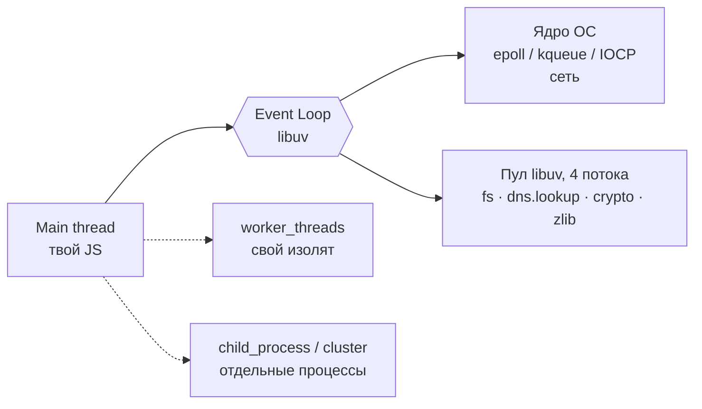
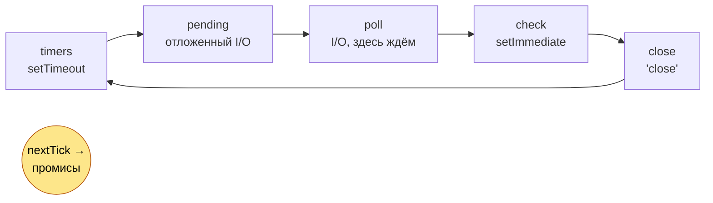
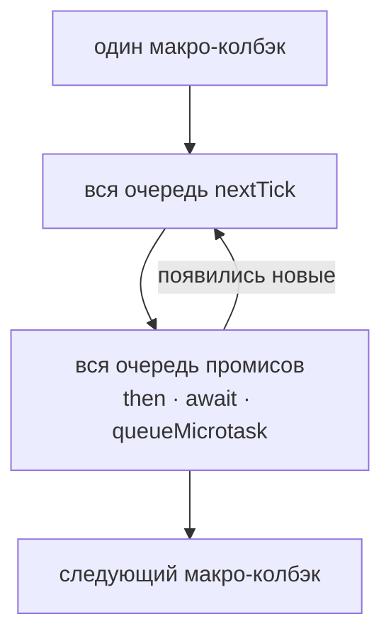
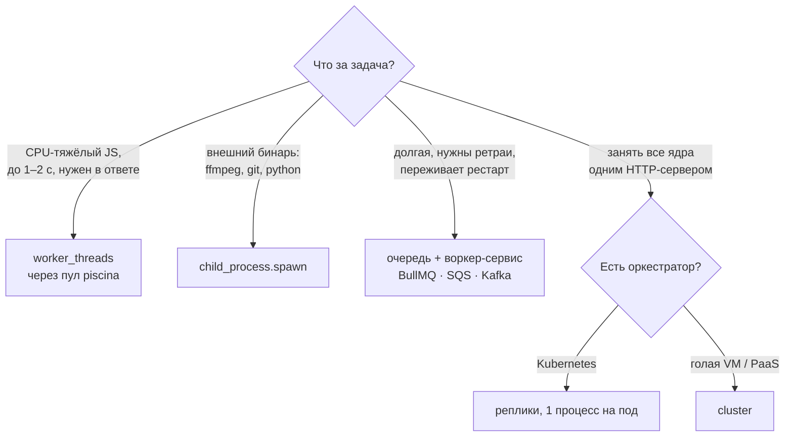
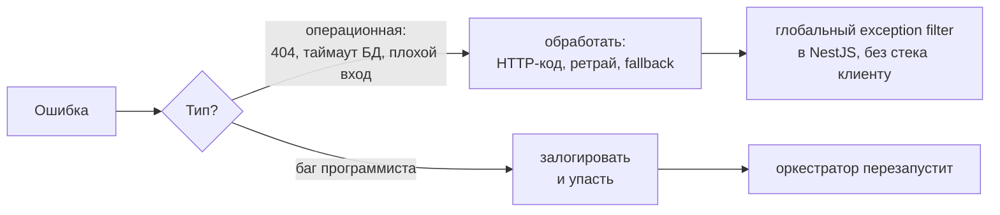

# Node.js: шпора к интервью

## Карта



| Что                  | Где выполняется                  | Блокирует цикл?     |
| -------------------- | -------------------------------- | ------------------- |
| Твой JS              | один main thread                 | да, пока работает   |
| Сетевой I/O          | ядро ОС                          | нет                 |
| `fs`, DNS, `crypto`  | пул libuv (`UV_THREADPOOL_SIZE`) | нет, но пул конечен |
| CPU-тяжёлый sync-код | main thread                      | **да**              |
| Параллельный JS      | `worker_threads` или процессы    | нет                 |

---

## 0. Разминка: что выведет?

```js
console.log('A');
setTimeout(() => console.log('B'), 0);
setImmediate(() => console.log('C'));
Promise.resolve().then(() => console.log('D'));
process.nextTick(() => console.log('E'));
console.log('F');
```

<details>
<summary><b>Ответ</b></summary>

| Модуль                                          | Вывод         | Обычно / изредка |
| ----------------------------------------------- | ------------- | ---------------- |
| CommonJS (`.cjs`, `.js` без `"type": "module"`) | `A F E D B C` | 19/20 · `…C B`   |
| ESM (`.mjs`, `.js` с `"type": "module"`)        | `A F D E B C` | 16/20 · `…C B`   |

- `A F` — синхронный код.
- **CJS: `E` раньше `D`.** Сначала очередь `nextTick`, потом промисы.
- **ESM: `D` раньше `E`.** Модуль уже выполняется внутри микрозадачи, V8 доводит очередь промисов до конца, и только потом Node берёт `nextTick` ([источник](https://nodejs.org/en/learn/asynchronous-work/understanding-setimmediate)).
- **`B` или `C` — не гарантировано.** `setTimeout(0)` — это 1 мс. Если она прошла до первой проверки таймеров, первым будет `B`, иначе `C`.

**Ловушка репо:** в `package.json` стоит `"type": "module"`, так что `order.js` — уже ESM. Для CJS переименуй в `order.cjs`.

</details>

---

## 1. Фазы event loop



| Фаза    | Что там                                                 |
| ------- | ------------------------------------------------------- |
| timers  | `setTimeout` / `setInterval`, у которых истёк срок      |
| pending | I/O-колбэки, отложенные с прошлого оборота (ошибки TCP) |
| poll    | готовые I/O-события от ОС; если пусто — ждём            |
| check   | `setImmediate`                                          |
| close   | события `'close'`                                       |

- После **каждого** колбэка (с Node 11): вся очередь `nextTick`, затем все промисы. Микрозадачи — **не фаза**.
- С libuv 1.45 (Node 20) таймеры внутри цикла идут после poll.
- Процесс завершается, когда не осталось таймеров и открытых хэндлов.

<details>
<summary><b>Вслух</b></summary>

Event loop — цикл libuv, который проходит фазы: таймеры, отложенные колбэки, poll (ждём I/O), check с `setImmediate`, close. После каждого колбэка Node опустошает `nextTick`, потом промисы, поэтому микрозадачи всегда раньше следующей макрозадачи.

> _The event loop processes callbacks in phases; microtasks drain after every callback, before the loop moves on._

</details>

---

## 2. `setTimeout(fn, 0)` или `setImmediate(fn)`?

| Откуда вызвано        | Кто первый                | Почему                        |
| --------------------- | ------------------------- | ----------------------------- |
| главный модуль        | не определено             | успела ли пройти 1 мс         |
| I/O-колбэк            | **всегда `setImmediate`** | после poll сразу check        |
| внутри `setImmediate` | по ситуации               | оба уйдут на следующий оборот |

```js
fs.readFile(__filename, () => {
  setTimeout(() => console.log('timeout'), 0);
  setImmediate(() => console.log('immediate')); // всегда первым
});
```

---

## 3. Микро- и макрозадачи, `nextTick`



| Микрозадачи (приоритет)                                | Макрозадачи                 |
| ------------------------------------------------------ | --------------------------- |
| `process.nextTick` — очередь Node, идёт первой в CJS   | `setTimeout`, `setInterval` |
| `Promise.then`, `await`, `queueMicrotask` — очередь V8 | `setImmediate`              |
|                                                        | I/O-колбэки, `'close'`      |

| Рекурсивно               | Результат                                                        |
| ------------------------ | ---------------------------------------------------------------- |
| `process.nextTick(spin)` | **I/O starvation**: poll не наступает, сервер молчит, CPU 100%   |
| `setImmediate(spin)`     | безопасно: каждый вызов уходит на следующий оборот, I/O успевает |

<details>
<summary><b>Вслух</b></summary>

`nextTick` выполняется сразу после текущей операции, раньше промисов и любой фазы. Нужен, например, чтобы `emit` сработал после того, как вызывающий подписался. Рекурсивный `nextTick` морит I/O голодом. Чтобы отложить работу, по умолчанию бери `setImmediate` или `queueMicrotask`.

> _Microtasks run before the loop continues; recursive nextTick starves I/O._

</details>

---

## 4. Поток и процесс

|           | Поток                                    | Процесс                    |
| --------- | ---------------------------------------- | -------------------------- |
| Память    | общая                                    | своя                       |
| Стоимость | дешевле (но в Node — свой V8-изолят)     | дороже: новый V8 + heap    |
| Связь     | `postMessage`, `SharedArrayBuffer`       | IPC, сокеты, пайпы         |
| Падение   | ошибка убьёт воркер; OOM/segfault — всех | падает только он           |
| В Node    | `worker_threads`                         | `child_process`, `cluster` |

Процесс Node многопоточный и без воркеров: пул libuv, GC и JIT в V8.

## 5. Что выбрать для тяжёлой работы



| API              | Создаёт                   | Нюанс                                                      |
| ---------------- | ------------------------- | ---------------------------------------------------------- |
| `worker_threads` | поток, свой изолят и цикл | старт ~десятки мс → пул, а не `new Worker` на запрос       |
| `child_process`  | процесс                   | `fork` = Node + IPC-канал                                  |
| `cluster`        | процессы, общий порт      | обёртка над `fork`; primary раздаёт соединения round-robin |

`worker_threads` не дают надёжности: процесс упал — задача потеряна.

---

## 6. Блокировка и пул libuv

```text
pbkdf2Sync в обработчике           100 × async pbkdf2, пул = 4
main ███████████ хэш               пул ████ 4 считаются
     └─ /health ждёт                    ░░░░░░░░░░░░ 96 в очереди
                                        + fs и dns.lookup тоже в очереди
```

| Вариант                   | Event loop | Проблема                                        |
| ------------------------- | ---------- | ----------------------------------------------- |
| `pbkdf2Sync` / `hashSync` | **занят**  | ни один запрос не обслуживается, даже `/health` |
| async `pbkdf2`            | свободен   | пул насыщается, тормозят `fs` и DNS             |
| `worker_threads`          | свободен   | честный параллелизм, ограничен ядрами           |

Лечение: async-версия, `UV_THREADPOOL_SIZE` ≈ числу ядер (максимум 1024), rate limit на логин, вынос в воркеры.

**Мои замеры** ([experiments/02-event-loop](../experiments/02-event-loop/README.md)), p99 лёгкого эндпоинта:

| Сценарий                   | p99    | RPS лёгкого |
| -------------------------- | ------ | ----------- |
| без нагрузки               | 10 мс  | 5243        |
| sync-хэш в том же процессе | 163 мс | 274         |
| хэш в `worker_threads`     | 17 мс  | —           |
| `cluster` × 4              | 156 мс | —           |

`cluster` поднял RPS тяжёлого с 40 до 62, но p99 лёгкого не вылечил: балансируются соединения, а не запросы. На одном CPU 4 воркера дали 28 RPS против 40 и в 5 раз больше памяти.

---

## 7. Ядра: `cluster` или контейнеры?

|                    | `cluster` в одном контейнере       | Реплики за балансировщиком |
| ------------------ | ---------------------------------- | -------------------------- |
| Балансировщик      | не нужен                           | нужен (есть в k8s)         |
| Перезапуск, health | сам, сложнее                       | оркестратор                |
| Лимиты, метрики    | общие на контейнер, мутные         | точные на под              |
| Где уместен        | голая VM, PaaS (`WEB_CONCURRENCY`) | **Kubernetes**             |

Ни то, ни другое не лечит блокировку event loop: это просто больше копий процесса.

---

## 8. Ошибки

```js
try {
  setTimeout(() => {
    throw new Error('boom'); // uncaughtException → exit 1
  });
  Promise.reject(new Error('x')); // unhandledRejection → exit 1 (Node 15+)
} catch {
  // сюда не попадём
}

try {
  await Promise.reject(new Error('x'));
} catch {
  // а это ловится: await возвращает в тот же фрейм
}
```

| Источник          | Как приходит ошибка     | Если не обработать             |
| ----------------- | ----------------------- | ------------------------------ |
| Promise / `async` | rejection               | `unhandledRejection` → падение |
| callback API      | `err` первым аргументом | теряется молча                 |
| `EventEmitter`    | событие `'error'`       | `throw` → падение              |
| колбэк таймера    | `throw`                 | `uncaughtException` → падение  |



Чек-лист: свои классы (`AppError` + `cause`), ловить только где можешь что-то сделать, `process.on('uncaughtException')` → лог, graceful shutdown, `exit(1)` (продолжать нельзя), `no-floating-promises` в линтере (есть в `.oxlintrc.json`).

---

## 9. `EventEmitter`

```js
const e = new EventEmitter();
e.on('data', (x) => console.log(x));
e.emit('data', 1); // синхронно, по порядку подписки
e.emit('error', new Error('x')); // нет подписчика → throw → падение
```

| Факт                             | Следствие                                                           |
| -------------------------------- | ------------------------------------------------------------------- |
| `emit` синхронный                | подписчики выполняются внутри вызова `emit`                         |
| `'error'` без подписчика бросает | у каждого стрима и сокета нужен `on('error')` или `stream.pipeline` |
| > 10 подписчиков на событие      | `MaxListenersExceededWarning`, обычно утечка                        |
| `events.once()` / `events.on()`  | промис / async-итератор                                             |

---

## 10. `Buffer`

```js
const b = Buffer.from('Привет', 'utf8');
b.length; // 12 байт, а 'Привет'.length === 6
b.toString('base64');
b.subarray(0, 2); // без копии, общая память!
Buffer.alloc(10); // нули; allocUnsafe быстрее, но с чужим мусором
```

|                 | Строка        | `Buffer`                       |
| --------------- | ------------- | ------------------------------ |
| Содержит        | текст, UTF-16 | байты (`Uint8Array`)           |
| Изменяемый      | нет           | да                             |
| Память          | heap V8       | большие — вне heap             |
| Где встречается | везде         | `fs`, сокеты, стримы, `crypto` |

Ловушки: `subarray`/`slice` не копируют, `allocUnsafe` не обнуляет, UTF-8 по чанкам ломается — нужен `StringDecoder` или `setEncoding`.

---

## 11. Node или Go?

| Задача          | Выбор                                                                                             |
| --------------- | ------------------------------------------------------------------------------------------------- |
| Прокси, 50k RPS | Это I/O, справятся оба. Голый прокси → Go или Envoy/nginx. BFF с логикой на TS → Node с репликами |
| Сжатие видео    | Сжимает **ffmpeg**, не язык. Очередь → воркер → `child_process.spawn('ffmpeg')`                   |

---

## Проверь себя

<details><summary>Async = parallel?</summary>

Нет. JS конкурентен в одном потоке, параллельны только ОС и пул libuv.

</details>

<details><summary><code>await</code> блокирует event loop?</summary>

Нет. Но синхронный CPU-код до `await` блокирует.

</details>

<details><summary><code>setTimeout(fn, 0)</code> выполнится сразу?</summary>

Нет: минимум 1 мс и только в фазе timers, после всех микрозадач.

</details>

<details><summary><code>emit()</code> асинхронный?</summary>

Нет, подписчики вызываются синхронно внутри `emit`.

</details>

<details><summary><code>cluster</code> создаёт потоки?</summary>

Нет, процессы (`child_process.fork`).

</details>

<details><summary><code>worker_threads</code> для запросов к БД и HTTP?</summary>

Нет, I/O и так не блокирует. Воркеры — для CPU-тяжёлого JS.

</details>

<details><summary>100 async <code>pbkdf2</code> выполнятся одновременно?</summary>

Нет: 4 в пуле, 96 в очереди, плюс тормозят `fs` и DNS.

</details>

<details><summary>Один процесс Node использует одно ядро?</summary>

Твой JS — да. Но пул libuv, GC, JIT и `worker_threads` используют другие.

</details>

<details><summary>Можно работать дальше после <code>uncaughtException</code>?</summary>

Нет, состояние неизвестно. Лог, graceful shutdown, `exit(1)`.

</details>

<details><summary>Почему в этом репо <code>order.js</code> печатает <code>D</code> раньше <code>E</code>?</summary>

`"type": "module"` в `package.json` делает его ESM, а ESM выполняется внутри микрозадачи.

</details>

## Наизусть

1. **Async ≠ parallel**
2. **Sync CPU-код блокирует цикл, даже `/health`**
3. **Пул libuv = 4 потока и общий для `fs`, DNS, `crypto`**
4. **`nextTick` → промисы → следующая фаза** (в ESM промисы первыми)
5. **`worker_threads` = потоки, `child_process`/`cluster` = процессы**
6. **`emit()` синхронный, `'error'` без подписчика роняет процесс**
7. **`Buffer` = байты, `subarray` без копии**
8. **`try/catch` не ловит `throw` из будущего колбэка, а `await` в `try` ловит**
