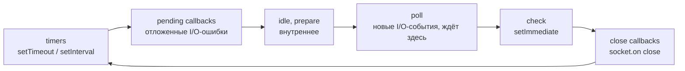

# Шпаргалка по Node.js к интервью

Версия Node: 24 (LTS). Каждое утверждение сверено с первоисточником, ссылка стоит рядом. Блок «Вслух» — ответ на 1–2 минуты.

## 0. Разминка: порядок вывода (`order.js`)

```js
console.log('A');
setTimeout(() => console.log('B'), 0);
setImmediate(() => console.log('C'));
Promise.resolve().then(() => console.log('D'));
process.nextTick(() => console.log('E'));
console.log('F');
```

| Как запущен                                         | Вывод                                |
| --------------------------------------------------- | ------------------------------------ |
| CommonJS (`.cjs` или `.js` без `"type": "module"`)  | `A F E D B C`, изредка `A F E D C B` |
| ES-модуль (`.mjs` или `.js` при `"type": "module"`) | `A F D E B C`, изредка `A F D E C B` |

Замер: 20 запусков на Node 24.15. CJS дал `B` раньше `C` 19 раз из 20, ESM — 16 из 20.

**Почему так:**

1. `A`, `F` — синхронный код, он выполняется сразу.
2. CJS: после синхронного кода Node сначала опустошает очередь `process.nextTick`, потом очередь микрозадач (промисов). Поэтому `E` идёт раньше `D`.
3. ESM: модуль загружается как асинхронная операция, поэтому весь код модуля уже выполняется внутри очереди микрозадач. Промис `D` встаёт в ту же очередь, и V8 доводит её до конца. Только после этого Node доходит до очереди `nextTick`, поэтому `D` идёт раньше `E` ([Understanding setImmediate](https://nodejs.org/en/learn/asynchronous-work/understanding-setimmediate)).
4. `B` против `C` — порядок **не гарантирован**. `setTimeout(fn, 0)` на деле равен `setTimeout(fn, 1)`. Перед входом в цикл libuv один раз проверяет таймеры ([Event Loop](https://nodejs.org/en/learn/asynchronous-work/event-loop-timers-and-nexttick)). Если с момента вызова `setTimeout` прошла 1 мс, первым выйдет `B`. Если процесс успел быстрее, таймер ещё не созрел: цикл дойдёт до фазы check, выполнит `C`, а `B` выведет на следующем обороте. Это зависит от загрузки машины, поэтому от запуска к запуску порядок меняется.
5. Внутри I/O-колбэка (например, в `fs.readFile`) порядок детерминирован: всегда `setImmediate` раньше, потому что после poll идёт check, а таймеры будут только потом.

**Ловушка этого репо:** в корневом `package.json` стоит `"type": "module"`, поэтому `order.js` здесь **уже ES-модуль**. Переименование в `.mjs` ничего не меняет. Чтобы увидеть CJS-порядок, переименуй файл в `order.cjs`.

## 1. Фазы event loop. Что происходит между фазами?



Источник: [Event Loop, Timers, and process.nextTick](https://nodejs.org/en/learn/asynchronous-work/event-loop-timers-and-nexttick).

- **timers** — колбэки `setTimeout`/`setInterval`, у которых истёк срок.
- **pending callbacks** — I/O-колбэки, отложенные на следующий оборот (например, некоторые ошибки TCP).
- **poll** — забирает готовые I/O-события у ОС (epoll / kqueue / IOCP) и выполняет их колбэки. Если делать нечего, процесс здесь ждёт.
- **check** — колбэки `setImmediate`.
- **close callbacks** — события `'close'`.
- Нюанс: с libuv 1.45 (Node 20) таймеры внутри цикла выполняются **после** poll. Один запуск таймеров до входа в цикл остался ради совместимости.

**Между фазами** и после каждого колбэка внутри фазы (с Node 11) Node опустошает сначала очередь `process.nextTick`, потом очередь микрозадач (промисы, `queueMicrotask`).

> **Вслух:** event loop — это цикл libuv, который по кругу проходит фазы: таймеры, отложенные колбэки, poll (здесь мы ждём I/O от ОС), check с `setImmediate` и close-колбэки. В каждой фазе своя очередь. Между любыми двумя колбэками Node до конца опустошает `nextTick`, затем промисы. Поэтому микрозадачи всегда выполняются раньше следующей макрозадачи. Процесс завершается, когда в цикле не осталось ни таймеров, ни открытых хэндлов.

## 2. `setTimeout(fn, 0)` или `setImmediate(fn)` — что раньше?

- **Из главного модуля** — не определено. Это зависит от того, прошла ли 1 мс до первой проверки таймеров (см. разминку).
- **Из I/O-колбэка** — всегда `setImmediate`: после poll сразу идёт check.
- **Внутри `setImmediate`**: следующий `setImmediate` попадёт уже на следующий оборот, а `setTimeout(0)` — тоже, но в фазу timers, то есть по ситуации.

```js
const fs = require('node:fs');
fs.readFile(__filename, () => {
  setTimeout(() => console.log('timeout'), 0);
  setImmediate(() => console.log('immediate')); // всегда первым
});
```

> **Вслух:** зависит от контекста. Вне I/O порядок недетерминирован: `setTimeout(0)` превращается в 1 мс, и если процесс вошёл в цикл раньше, чем она прошла, первым будет `setImmediate`. Внутри I/O-колбэка мы в фазе poll, следующая — check, поэтому `setImmediate` гарантированно раньше. Если нужно «сразу после текущего I/O», выбирай `setImmediate`.

## 3. Микрозадачи vs макрозадачи

| Микрозадачи                                             | Макрозадачи (колбэки фаз)           |
| ------------------------------------------------------- | ----------------------------------- |
| `process.nextTick` (своя очередь Node, идёт первой)     | `setTimeout`, `setInterval`         |
| `Promise.then/catch/finally`, `await`, `queueMicrotask` | `setImmediate`                      |
|                                                         | I/O-колбэки (`fs`, сеть), `'close'` |

Порядок: выполняется один колбэк макрозадачи, затем **вся** очередь `nextTick`, затем **вся** очередь промисов. Если промисы породили новые `nextTick`, цикл повторяется. Только после этого выполняется следующий макро-колбэк ([Event Loop](https://nodejs.org/en/learn/asynchronous-work/event-loop-timers-and-nexttick), [javascript.info](https://javascript.info/event-loop)).

> **Вслух:** макрозадачи — это колбэки, которые event loop берёт из очередей фаз: таймеры, I/O, `setImmediate`. Микрозадачи — промисы и `nextTick`, у них приоритет. После каждого макро-колбэка Node до конца опустошает сначала `nextTick`, потом промисы. Поэтому бесконечная цепочка микрозадач подвесит процесс: до I/O дело не дойдёт.

## 4. `process.nextTick` vs промис. Рекурсивный `nextTick`

- `nextTick` — очередь Node, а не стандарт JS. Она выполняется **раньше** промисов (в CJS; про ESM см. разминку).
- Промисы — очередь микрозадач V8 по спецификации ECMAScript.
- Рекурсивный `nextTick` **морит I/O голодом**: цикл не доходит до poll, сервер перестаёт отвечать, хотя процесс жив и грузит CPU на 100%. Защиту `process.maxTickDepth` убрали ещё в Node 0.12.
- Рекурсивный `setImmediate` безопасен: новые immediate попадают на **следующий** оборот, и I/O между ними успевает выполниться.

```js
function spin() {
  process.nextTick(spin); // сервер больше не примет ни одного запроса
}
```

> **Вслух:** `nextTick` выполняется сразу после текущей операции, раньше промисов и любой фазы цикла. Его используют, чтобы вызвать колбэк асинхронно, но до любого I/O, например, чтобы `emit` сработал после того, как вызывающий успел подписаться. Рекурсивный `nextTick` блокирует цикл: очередь никогда не опустеет, poll не наступит. Документация прямо называет это starving I/O. Для «отложить на потом» по умолчанию бери `setImmediate` или `queueMicrotask`.

## 5. Поток vs процесс

|           | Процесс                                 | Поток                                                                                         |
| --------- | --------------------------------------- | --------------------------------------------------------------------------------------------- |
| Память    | своё адресное пространство              | общее с другими потоками процесса                                                             |
| Стоимость | дорогой старт, в Node — новый V8 + heap | дешевле, но в Node у каждого worker свой V8-изолят                                            |
| Связь     | IPC, сокеты, пайпы                      | общая память (`SharedArrayBuffer`), `postMessage`                                             |
| Падение   | падает только он                        | необработанная ошибка в `worker` убьёт только воркер, но OOM или segfault уронят весь процесс |
| Планирует | ОС                                      | ОС                                                                                            |

> **Вслух:** процесс — единица изоляции: своя память, свои ресурсы ОС, общаются через IPC. Поток — единица исполнения внутри процесса, потоки делят память. В Node важный нюанс: JS у тебя в одном главном потоке, но процесс многопоточный. Есть пул libuv, потоки GC и JIT в V8, и можно создавать `worker_threads`.

## 6. `worker_threads`, `child_process`, `cluster` — что поток, что процесс?

| API                                                            | Что это                                                                                                                     | Когда                                                     |
| -------------------------------------------------------------- | --------------------------------------------------------------------------------------------------------------------------- | --------------------------------------------------------- |
| [`worker_threads`](https://nodejs.org/api/worker_threads.html) | **поток** в том же процессе, свой V8-изолят и event loop; `postMessage`, `SharedArrayBuffer`                                | CPU-тяжёлый JS: хэши, парсинг, сжатие, обработка картинок |
| [`child_process`](https://nodejs.org/api/child_process.html)   | **процесс**: `spawn`/`exec` запускают любой бинарь, `fork` — Node с IPC-каналом                                             | внешние программы (ffmpeg, git), полная изоляция          |
| [`cluster`](https://nodejs.org/api/cluster.html)               | **процессы**: `fork` копий того же сервера, которые делят один порт; primary раздаёт соединения round-robin (кроме Windows) | загрузить все ядра одним HTTP-сервером                    |

> **Вслух:** `worker_threads` — потоки, а `child_process` и `cluster` — процессы. `cluster` — это обёртка над `child_process.fork`, которая умеет делить один слушающий сокет. Воркер-поток дешевле процесса и может делить память, но у него свой изолят, так что это не «лёгкие потоки» как в Go. Для CPU-задачи внутри сервиса — `worker_threads`, для масштабирования HTTP по ядрам — `cluster` или несколько контейнеров.

## 7. Когда `worker_threads`, а когда отдельный сервис или очередь?

- **`worker_threads`**: задача короткая (миллисекунды–секунды), нужна прямо в ответе на запрос, а данные уже в памяти. Например, хэш пароля, валидация большого JSON, ресайз аватарки. Пул — [piscina](https://github.com/piscinajs/piscina), а не новый `Worker` на запрос: старт изолята стоит десятки миллисекунд.
- **Очередь (BullMQ, SQS, Kafka) + отдельный воркер-сервис**: задача долгая (секунды–часы), её можно выполнить позже, её нужно ретраить, переживать рестарты, масштабировать отдельно от API. Например, перекодирование видео, отчёты, рассылки.
- **Отдельный сервис на другом языке**: тяжёлые вычисления — основная работа, а не эпизод (ML, видео, числодробилки).

Мой замер ([experiments/02-event-loop](../experiments/02-event-loop/README.md)): при CPU-нагрузке p99 лёгкого эндпоинта — 163 мс в одном процессе против 17 мс с `worker_threads` (без нагрузки 10 мс).

> **Вслух:** если тяжёлая работа нужна синхронно для ответа и длится до секунды-двух — пул `worker_threads`, он разгружает event loop. Если её можно отложить, нужны ретраи, она должна пережить рестарт или масштабироваться отдельно — очередь и отдельный воркер. `worker_threads` не дают надёжности: процесс упал — задача потеряна.

## 8. `throw` в колбэке `setTimeout` и промис без `catch`

```js
try {
  setTimeout(() => {
    throw new Error('boom'); // uncaughtException → процесс падает
  });
  Promise.reject(new Error('no catch')); // unhandledRejection → процесс падает (Node 15+)
} catch {
  // сюда не попадём
}
```

- `try/catch` ловит только то, что брошено **синхронно, пока его блок на стеке**. Колбэк таймера выполнится позже, на другом обороте цикла, с пустым стеком. Блока `try` уже нет, ошибка становится `uncaughtException`, процесс завершается с кодом 1.
- Отклонённый промис без обработчика вызывает `unhandledRejection`. С Node 15 режим по умолчанию `--unhandled-rejections=throw`: процесс падает ([CLI docs](https://nodejs.org/api/cli.html#--unhandled-rejectionsmode)).
- Внутри `async`-функции `try { await x }` **ловит** отказ промиса: `await` возвращает управление в тот же фрейм.

Проверено в эксперименте: эндпоинт `/crash` бросает исключение в `setTimeout` и убивает воркер, а `cluster` поднимает новый.

> **Вслух:** `try/catch` синхронный. Колбэк `setTimeout` выполнится на другом тике, когда `try` уже снят со стека, поэтому ошибка уходит в `uncaughtException` и роняет процесс. С промисом то же самое, но через `unhandledRejection`, и с Node 15 это тоже падение. Лечение: `await` внутри `try`, `.catch` на каждой цепочке, линтер `no-floating-promises`.

## 9. Обработка ошибок в Node-сервисе

1. **Различаю два вида** ([Node.js Best Practices](https://github.com/goldbergyoni/nodebestpractices#2-error-handling-practices)):
   - **операционные** — ожидаемые: невалидный вход, 404, таймаут БД, отказ стороннего API. Их обрабатываю: даю правильный HTTP-код, делаю ретрай, включаю fallback;
   - **ошибки программиста** — баги: `undefined is not a function`, нарушенный инвариант. Их не «обрабатываю»: логирую и даю процессу упасть, оркестратор перезапустит.
2. **Где ловлю:** на границе. В NestJS это глобальный exception filter, который мапит доменные ошибки в HTTP и не отдаёт клиенту стек. Внутри сервиса — только там, где реально могу что-то сделать (ретрай, компенсация).
3. **Свои классы ошибок** (`NotFoundError extends AppError`) с кодом и `cause` (`new Error('...', { cause })`), а не строки.
4. **Глобальная страховка:** `process.on('uncaughtException' | 'unhandledRejection')` → залогировать, корректно закрыть сервер, `process.exit(1)`. Продолжать работу после `uncaughtException` нельзя: состояние неизвестно ([docs](https://nodejs.org/api/process.html#warning-using-uncaughtexception-correctly)).
5. **Статика:** `no-floating-promises` в линтере (уже стоит в этом репо, `.oxlintrc.json`).

> **Вслух:** делю ошибки на операционные и баги. Операционные — часть контракта: валидирую вход, мапю в 4xx/5xx в одном exception filter, ставлю таймауты и ретраи на внешние вызовы. Баги не глотаю: логирую со стеком и падаю, процесс перезапустит оркестратор. Плюс линтер против забытых `await` и глобальные обработчики как последний рубеж для лога и graceful shutdown.

## 10. `EventEmitter` и `emit('error')` без подписчика

```js
import { EventEmitter } from 'node:events';
const e = new EventEmitter();
e.on('data', (x) => console.log(x));
e.emit('data', 1); // синхронно вызывает всех подписчиков по порядку
e.emit('error', new Error('x')); // нет подписчика на 'error' → throw → процесс падает
```

- `EventEmitter` — реализация паттерна «наблюдатель», на нём построены стримы, `http.Server`, сокеты.
- `emit` **синхронный**: подписчики выполняются прямо внутри вызова `emit`, по порядку подписки.
- Событие `'error'` особое: без подписчика `emit('error', err)` **бросает** `err`, а без `catch` выше по стеку это `uncaughtException` и падение ([Events: Error events](https://nodejs.org/api/events.html#error-events)).
- Утечки: больше 10 подписчиков на одно событие дают warning `MaxListenersExceededWarning`. Обычно это признак, что `on` вызывается в цикле или на каждый запрос и не снимается.
- `events.once(emitter, 'name')` возвращает промис, `events.on(...)` — async-итератор.

> **Вслух:** `EventEmitter` — это pub/sub внутри процесса: `on` подписывает, `emit` синхронно вызывает подписчиков. Событие `'error'` — исключение из правил: если на него никто не подписан, `emit` бросает ошибку, и процесс падает. Поэтому у каждого стрима и сокета должен быть обработчик `'error'`, а лучше использовать `stream.pipeline`, который пробрасывает ошибки сам.

## 11. `Buffer`

```js
const b = Buffer.from('Привет', 'utf8');
b.length; // 12 — байты, а не символы ('Привет'.length === 6)
b.toString('base64'); // кодировки: utf8, hex, base64, latin1…
b.subarray(0, 2); // view без копирования, общая память!
Buffer.alloc(10); // заполнен нулями; Buffer.allocUnsafe — быстрее, но со старым мусором
```

- `Buffer` — подкласс `Uint8Array`: последовательность **байтов** фиксированной длины. Память выделяется вне heap V8 (большие буферы), поэтому не упирается в лимит heap.
- Зачем, если есть строки: строки в JS — UTF-16 и неизменяемые, ими нельзя без потерь представить бинарь (картинку, gzip, протокол Postgres). Массив чисел занимает около 8 байт на элемент вместо одного.
- Где встречается: `fs.readFile` без кодировки, сокеты, стримы, `crypto`.
- Ловушки: `subarray`/`slice` **не копируют**, `allocUnsafe` может отдать чужие данные, а склейка UTF-8 по чанкам ломает многобайтовые символы (используй `StringDecoder` или `setEncoding`) ([Buffer docs](https://nodejs.org/api/buffer.html)).

> **Вслух:** `Buffer` — это массив байтов, `Uint8Array` с удобствами Node: кодировки, чтение чисел, сравнение. Нужен, потому что сеть и диск отдают байты, а не текст. Строка в JS — UTF-16 и не годится для бинарных данных, массив чисел — в восемь раз толще. Главные ловушки: `subarray` делит память с исходником, `allocUnsafe` не обнуляет память, а UTF-8 нельзя декодировать по кускам наивно.

## 12. Асинхронно или параллельно? «non-blocking, event-driven»

- **Конкурентно, а не параллельно** для JS-кода: в один момент выполняется один колбэк, но тысячи операций одновременно «в полёте».
- **Параллельно** работают ОС и пул libuv: сетевой I/O ждёт ядро (epoll), а `fs`, `dns.lookup`, `crypto.pbkdf2`, `zlib` выполняются на пуле из 4 потоков по умолчанию (`UV_THREADPOOL_SIZE`, до 1024) ([Don't Block the Event Loop](https://nodejs.org/en/learn/asynchronous-work/dont-block-the-event-loop)).
- **Non-blocking**: вызов I/O сразу возвращает управление, результат придёт колбэком. **Event-driven**: программа — это набор реакций на события из очереди.

> **Вслух:** JS-код в Node выполняется в одном потоке, поэтому это конкурентность, а не параллелизм. Пока запрос ждёт базу, поток обрабатывает другие запросы. Но сам процесс параллелен: сетевое ожидание делает ядро ОС, а файлы и крипто считаются на пуле потоков libuv. Non-blocking значит, что вызов не ждёт результата, event-driven — что код реагирует на события из очереди.

## 13. `bcrypt.hashSync` / `pbkdf2Sync` в обработчике. А async для 100 запросов?

- **Sync**: хэш выполняется в главном потоке и блокирует event loop. Пока он считается, **ни один** другой запрос не обслуживается, даже `/health`. Мой замер: p99 лёгкого эндпоинта вырос с 10 мс до 163 мс, RPS упал с 5243 до 274 ([эксперимент](../experiments/02-event-loop/README.md)).
- **Async** (`crypto.pbkdf2`, `bcrypt.hash` из пакета `bcrypt`) уходит в пул libuv. Event loop свободен, но в пуле **4 потока**. 100 одновременных хэшей встают в очередь, 4 считаются, 96 ждут. Латентность хэшей растёт ступеньками, и они делят пул с `fs` и `dns.lookup`: файлы и резолв имён тоже начинают тормозить.
- Что делать: async-версия + `UV_THREADPOOL_SIZE` ≈ числу ядер, rate limit на логин, при большой нагрузке вынести в отдельный сервис или пул `worker_threads`.

> **Вслух:** sync-версия замораживает весь процесс на время хэша, все запросы ждут. Async уходит в пул libuv, цикл свободен, но пул по умолчанию из четырёх потоков. На сотне запросов получится очередь, и она заодно затормозит файловый I/O и DNS, которые сидят в том же пуле. Пул можно расширить переменной `UV_THREADPOOL_SIZE`, но больше ядер он не даст.

## 14. Сколько ядер у одного процесса? `cluster` или контейнеры?

- JS-код занимает **одно** ядро. Пул libuv и GC добавляют немного параллелизма, но CPU-bound JS на одном процессе упирается в одно ядро.
- **`cluster`**: один контейнер, N процессов, primary раздаёт соединения. Плюсы: не нужен внешний балансировщик, удобно на VM или PaaS (Heroku `WEB_CONCURRENCY`). Минусы: primary — лишний хоп и единая точка отказа, метрики и healthcheck сложнее, лимит CPU контейнера всё равно общий.
- **Несколько контейнеров** (по одному процессу на контейнер) за балансировщиком в Kubernetes: оркестратор сам перезапускает, масштабирует и делает healthcheck, лимиты на под точные, метрики честные.
- Мой выбор: в Kubernetes — **контейнеры**, по одному процессу, без `cluster`. `cluster` — на голой VM или PaaS без оркестратора.
- Замер: `cluster` на 4 воркера поднял пропускную способность тяжёлого эндпоинта в 1.5 раза (40 → 62 RPS), но p99 лёгкого остался 156 мс. Блокировку он не лечит: лёгкий запрос всё равно попадает на воркер, занятый хэшем. Балансируются соединения, а не запросы. На одном CPU (`taskset`) 4 воркера дали 28 RPS против 40 у одного процесса, а памяти съели в 5 раз больше.

> **Вслух:** один процесс исполняет JS на одном ядре. Чтобы занять все ядра, нужно несколько процессов: либо `cluster` внутри контейнера, либо несколько реплик за балансировщиком. В Kubernetes я выбираю реплики: перезапуск, healthcheck, лимиты и метрики уже есть у оркестратора, а `cluster` их дублирует и прячет процессы от него. `cluster` уместен на VM без оркестратора. И главное: ни то, ни другое не лечит блокировку event loop, это только больше копий одного процесса.

## 15. Node или Go: 50k RPS проксирования? Сжатие видео?

- **Прокси на 50k RPS**: это чистый I/O, и обе платформы справятся. Go займёт все ядра одним процессом, у него меньше памяти и хвостов латентности из-за отсутствия однопоточного узкого места; у Node понадобится несколько процессов или реплик. Если команда на TypeScript и в прокси есть бизнес-логика (BFF), выберу Node с репликами. Если это голый инфраструктурный прокси под высокой нагрузкой, выберу Go (или готовый Envoy/nginx).
- **Сжатие видео**: CPU-bound, и это не задача ни для Node, ни для Go напрямую — её делает **ffmpeg**. Сервис ставит задачу в очередь, воркер запускает ffmpeg через `child_process.spawn` и следит за прогрессом. Node тут нормален как оркестратор; Go удобнее, если нужно много параллельных задач с собственной обработкой кадров.

> **Вслух:** для прокси узкое место — сеть, Node справится репликами по числу ядер, а Go — одним процессом, и с меньшими хвостами p99. Выбор решают команда и логика внутри. Видео сжимает ffmpeg, а не язык. Сервис кладёт задачу в очередь, воркер запускает ffmpeg дочерним процессом. Держать перекодирование в event loop Node нельзя ни при каких условиях.
